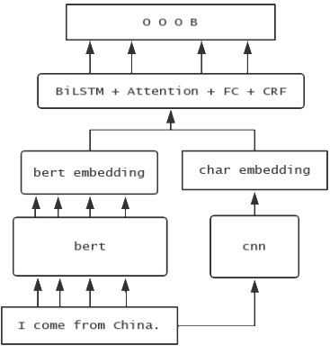

# bert-entity-recognition

Named entity recognition using BERT under BiLSTM-CRF framework.

## network structure

(BERT + CNN) + BiLSTM + Attention + CRF

 

## Production Env

`api.py` provide a simple flask api for model inference using cpu.

`stream.py` provide a multi-gpu way for inference with the help of [ShannonAI/service-streamer](https://github.com/ShannonAI/service-streamer).

## Dir Tree

```
.
├── api.py --- [simple flask api]
├── attention.py --- [attention module, dot-scaled & multi-head attention]
├── bert --- [bert base or bert large]
├── bilstm.py --- [rnn module]
├── cnn.py --- [cnn module, for char embedding]
├── config.py --- [config module]
├── crf.py --- [crf module]
├── log.py --- [logging module]
├── main.py --- [main entry, for training & fine_tuning & testing]
├── metric.py --- [metrice module, marco & micro P R F1]
├── model.py --- [model module, using bert directly or with BiLSTM+CRF]
├── ncrf.py --- [ncrf module, just for recall test]
├── network.png --- [network structure screenshot]
├── readme.md --- [readme]
├── stream.py --- [multi-gpu flask api]
└── util.py --- [dataset module]
```